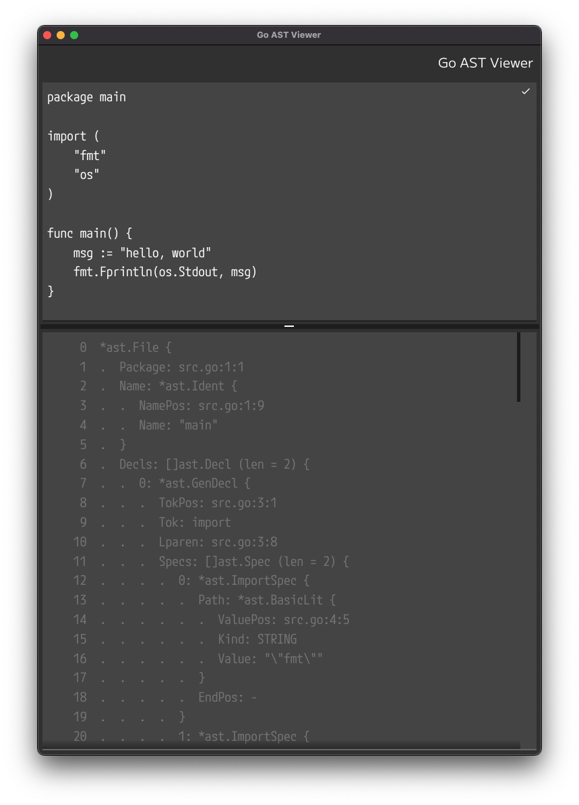

# go-astviewer

Desktop application that displays the AST nodes of Go language parsing results.



## Usage

go +1.17

```shell
go run github.com/micheam/go-astviewer@latest
```

## Requirements

## Installation

## License

## Author

